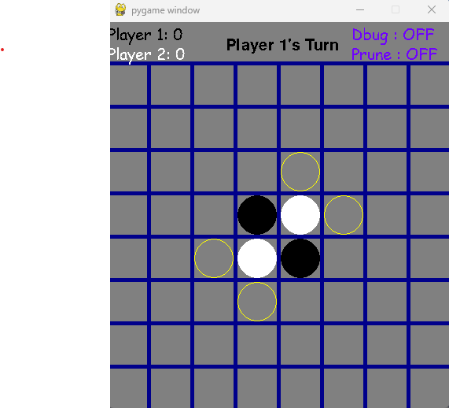
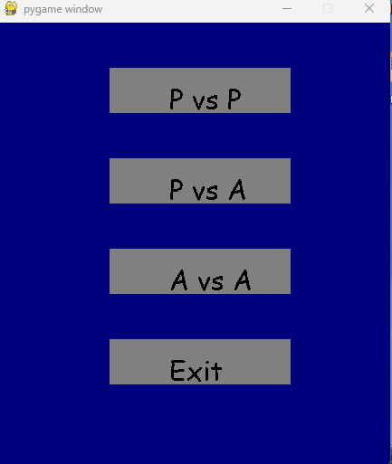

# Othello

This is a bord game somewhat like GO that involves placing pieces and traping(claiming) your oponents pieces. The game is score bases so the player with the most pieces of their color wins at the end.

# Sources

- basics of pygame https://www.youtube.com/watch?v=y9VG3Pztok8
- minimax algorithum https://www.youtube.com/watch?v=l-hh51ncgDI
- more on minimax https://www.youtube.com/watch?v=Xly7lpTQELI
- example with pruning https://www.youtube.com/watch?v=_i-lZcbWkps

# Files
 
 - board.py - Handles all the rendering of the board and a 2d array representing the board

 - game.py - Handles the interactions between the player and the board and reads input form the user

 - player.py - stores information about the players in the game

# Rules / Controles

- There are 3 main game modes PvP, AivAi and PvAi
- Use (escape) to open the menu that lets you select the mode on a turn by turn basis
- When In PvAi mode you will be able to select a position if it is "blacks" turn else it will be the Ai's turn
when it is the Ai's turn by pressing (a) or (i) on your keyboard the ai will make its move
- When in AivAi mode you can use the (a) or (i) key to allow each ai to make its move
- The score of each player will appear in the top right and be updated turn by turn
- The game text should tell you whos turn it is at the top
- to toggle debug mode press the (d) on keyboard 
- to toggle alphaBetaPrune mode press the (p) on your keyboard

# Basic Game Display

# Menu Display

